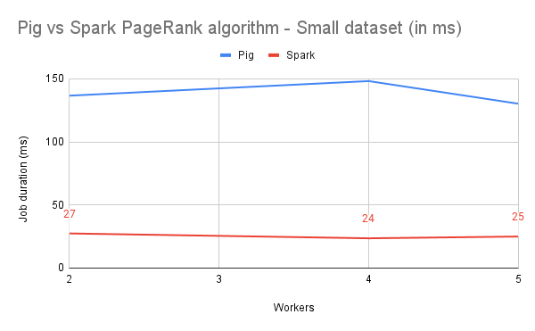
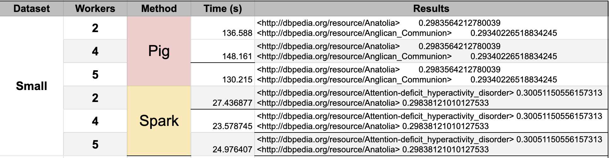
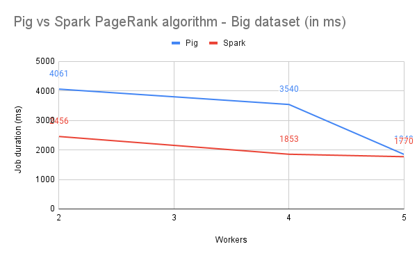
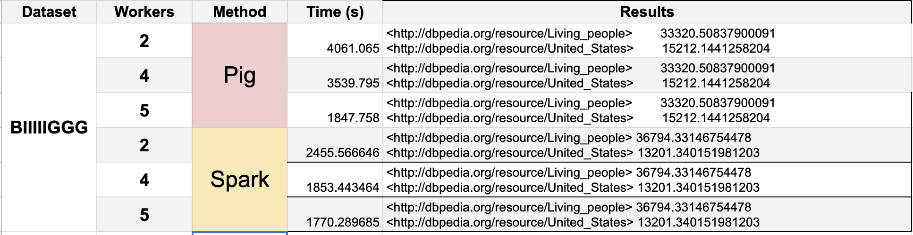

# PageRank on Google Cloud Platform using Pig and Spark

Malo GRALL

Alex MAINGUY

Mathis ROCHER

## Method

### Small dataset

### Big dataset

## Problems 

In order to get clearer results, we gathered Spark results and saved them in a separate file instead of printing them in the terminal with the Cloud Logging for python feature of GCP.

With pig we had trouble debugging with the logs because they were not easily accessible in GCP. The Logging menu had some logs but they were only logging the terminal outputs.
